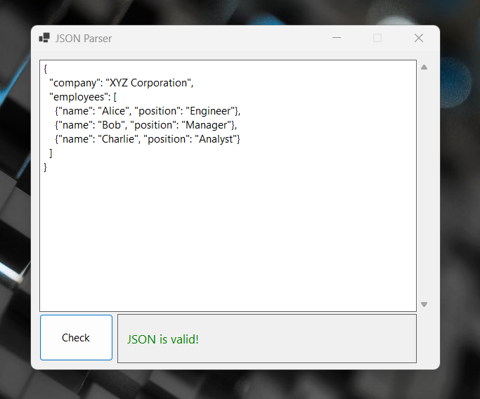
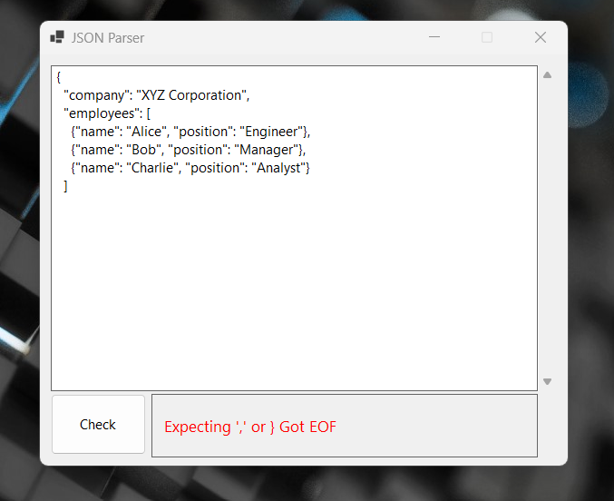

# JSON Parser

Simple JSON parser that includes a lexer and a parser for JSON, inspired by the [Code Challenge](https://codingchallenges.fyi/challenges/intro) initiative.

This project is a desktop application created using Windows Forms and C#. 

Features to be add:
- Scientific Notation Validation
- Escape Characters Validation

## How to Use

1. Insert your JSON text on the Text Box
2. Click on the `Check` button
3. The application will return a message telling you if your JSON is valid or not

    3.1 Valid example
    
    

    3.2 Invalid example

    
